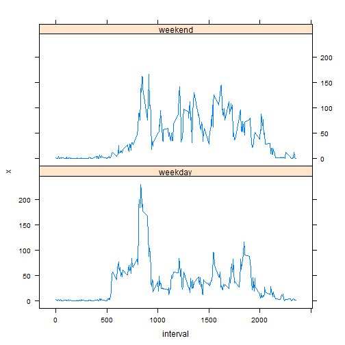

## Loading and preprocessing the data


```r
require(lattice)
# Download the file and unzip it.
destURL <- "https://d396qusza40orc.cloudfront.net/repdata%2Fdata%2Factivity.zip"
download.file(destURL,"./repdata-data-activity.zip")
unzip("./repdata-data-activity.zip")

# read in the data and rearrange the columns to make better sense
initData <- read.csv("./activity.csv")
initData <- subset(initData, select = c("date","interval","steps"))
```

The data represents physical steps taken monitoring with a personal device.  It consists of the date, a 5 minute interval, and the number of steps within that interval.  There are 288 5-minute intervals in a day.


```r
# examine data to see how many intervals exist.
length(unique(initData$interval))
```

```
## [1] 288
```

```r
# examine data to see if NA span entire days
table(factor(initData[is.na(initData$steps),]$date))
```

```
## 
## 2012-10-01 2012-10-08 2012-11-01 2012-11-04 2012-11-09 2012-11-10 
##        288        288        288        288        288        288 
## 2012-11-14 2012-11-30 
##        288        288
```

Looking at the data, we can see that there are 288 unique intervals, and that for 8 of those days there is no data collected. 

Keeping in mind that data missing spans entire days, I decided that the data require no further massaging.  It seems to be in a tidy format, as the columns each represent a variable, and the rows an observation.

## What is mean total number of steps taken per day?

Since the data containing steps with NA values traversed the entire day. I decided that ignoring the NA for the summation was unnecessary, as it would create a value of zero, and would actually create false data.  Also in the later part of the investigation the values will be imputed.


```r
# sum the total steps by the date.  Since entire days are
# missing data, we can safely set na.rm to FALSE.  Setting to true
# would set those missing days to zero.
totalStepsPerDay <- aggregate(initData$steps,
                        by=list(date=initData$date),FUN=sum,na.rm=FALSE)
```

The following histogram shows the frequency of the total steps taken in a day.  It shows that largest group of the steps taken were between 10,000 and 11,000 steps in a day.  This gives us an idea where the mean and median lie.


```r
# create a histogram on the sum data
hist(totalStepsPerDay$x,breaks=20,
     xlab = "Total Steps Taken Per Day",
     main = "Histogram of Total Steps Per Day")
```

 

```r
#calculate the mean and median
totalStepMean <- mean(totalStepsPerDay$x,na.rm=TRUE)
totalStepMean
```

```
## [1] 10766.19
```

```r
totalStepMeidan <- median(totalStepsPerDay$x,na.rm=TRUE)
totalStepMeidan
```

```
## [1] 10765
```

From this data we calculated the mean and median.

Mean: 10766.19

Median: 10765

## What is the average daily activity pattern?

Next I looked at the data from an interval perspective, creating an average for each interval across all the days given.  Once again the NAs were ignored.


```r
# calculate the mean by interval
avgDaily <- aggregate(initData$steps,
                      by=list(intrv=initData$interval),FUN=mean,na.rm=TRUE)
names(avgDaily) <- c("interval","avg")
```

The following plot shows the averaging of the intervals for all of the days recorded.  


```r
# plot the averaged interval data
with(avgDaily,plot(interval,avg, type = "l", 
        xlab = 'Interval',
        ylab = 'Average number of Steps'))
```

 

```r
# get the interval with the largest value.
maxAvg <- avgDaily[avgDaily$avg == max(avgDaily$avg),]$interval
maxAvg
```

```
## [1] 835
```

The 5-minute interval containing the max number of steps on average across all of the days recorded: 835

The most of the steps seem to be taken between 7 and 10 am, with burst through out the day.  A possible scenario is that this person works in an office, with a large burst in the morning as they are either preparing for work or walking to work.

## Imputing missing values

There were 8 days of complete missing data.


```r
# count the number of rows containing NA from the original data.
numMissRows <- sum(is.na(initData$steps))
numMissRows
```

```
## [1] 2304
```

This translates into 2304 rows of data containing NA for the step column.

To fill in the missing data, I used the averages of steps(across all days)  computed for each interval, as was calculated in the "What is the average daily activity pattern" section. The intervals missing data were assigned these averaged data.


```r
# merge the inital data with the averaged interval data by the interval column.
missIn <- merge(initData,avgDaily,by="interval")

# make a copy of the existing NA column for reference
missIn$CopyOfSteps <- missIn$steps

# copy the averaged step data to the step column for those intervals with NA steps.
missIn$steps[is.na(missIn$CopyOfSteps)] <- missIn$avg[is.na(missIn$CopyOfSteps)]

# Cleanup the data frame to only keep the date, interval and steps.
missIn <- subset(missIn, select = c("date","interval","steps"))

# Reorder the data, since a merge messes it up.  This is the new dataset
missIn <- missIn[order(as.Date(missIn$date, format="%Y-%m-%d")),]

# create the sum of the total number of steps on the new data set.
newTotal <- aggregate(missIn$steps,by=list(date=missIn$date),FUN=sum,na.rm=TRUE)
```

The histogram below show the total number of steps from the new data set.


```r
# show it in a histogram
hist(newTotal$x,breaks=20,
     xlab = "Total Steps Taken Per Day",
     main = "Total Steps - Modified data")
```

 

From this data we calculated the new mean and median.


```r
# calculate the mean
newStepMean <- mean(newTotal$x)
newStepMean
```

```
## [1] 10766.19
```

```r
# calculate the median
newStepMedian <- median(newTotal$x)
newStepMedian
```

```
## [1] 10766.19
```

Mean: 10766.19

Median: 10766.19

The Mean is the same as the previous data set, this is due to the fact I used the averages of the intervals, which means the totals for that day is the same as the average, therefore the overall average won't change.

The Median changed, as there was higher data to raise the median.

Using a different imputing method would have changed these values further.  The impact of imputing the data on the estimates of the total daily number of steps, means that the incorrect answer could be reached.

## Are there differences in activity patterns between weekdays and weekends?

Looking at the averaged imputed data by weekday and weekend, shows us that weekday pattern matches the averaged data from the previous data.  

The weekend data shows us that the subject is walking more.


```r
# Create a new factor seperating the days into weekday and weekend.  
# Add it to the existing dataset
missIn <- cbind(missIn,factor(weekdays(as.Date(missIn$date)), 
        levels = c("Monday","Tuesday","Wednesday","Thursday","Friday","Saturday","Sunday"), 
        labels = c("weekday","weekday","weekday","weekday","weekday","weekend","weekend")))
```

```
## Warning in `levels<-`(`*tmp*`, value = if (nl == nL) as.character(labels)
## else paste0(labels, : duplicated levels in factors are deprecated
```

```r
names(missIn)[4] <- "weekend"

# Figure out the average on the intervals by weekday and weekend
avgByWeekday <- aggregate(missIn$steps,by=list(interval=missIn$interval,                        weekday=factor(missIn$weekend)),FUN=mean,na.rm=TRUE)
```

```
## Warning in `levels<-`(`*tmp*`, value = if (nl == nL) as.character(labels)
## else paste0(labels, : duplicated levels in factors are deprecated
```

```r
# Plot the data
xyplot(x ~ interval | weekday,avgByWeekday,type = "l", layout=c(1,2) )
```

 
